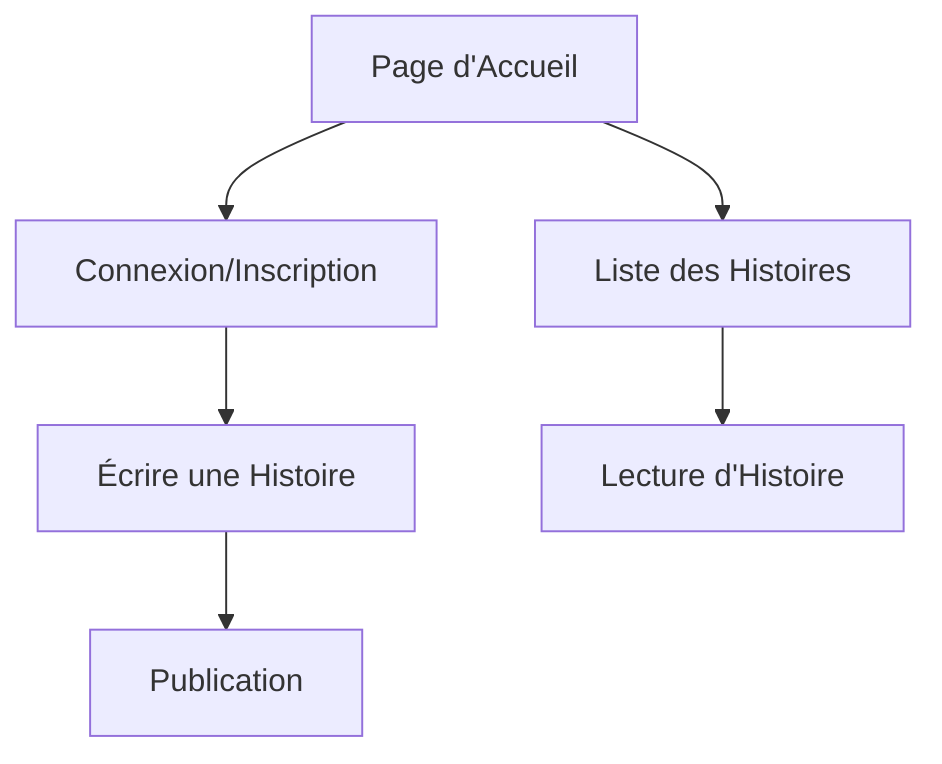
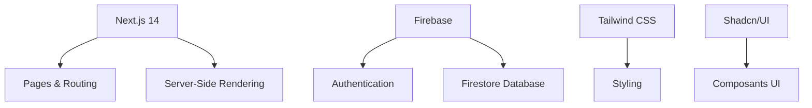
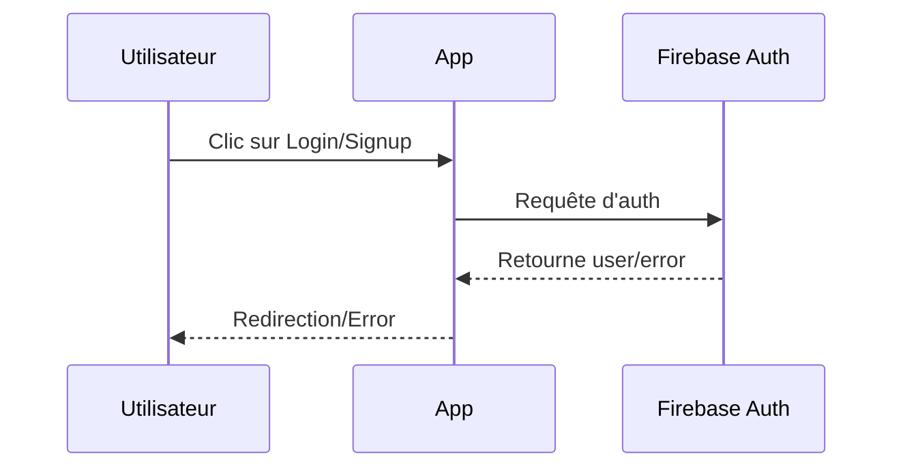
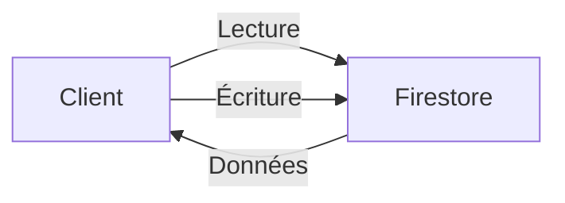

# Documentation Athemaria

## 1. Introduction et Vue d'Ensemble

Athemaria est une plateforme moderne de partage d'histoires construite avec Next.js 14. Cette application permet aux utilisateurs de lire et d'écrire des histoires, avec un système d'authentification complet.



### 1.1 Fonctionnalités Principales

- Authentification des utilisateurs (inscription/connexion)
- Création et publication d'histoires
- Lecture d'histoires
- Interface responsive (mobile et desktop)
- Thème clair/sombre

## 2. Technologies Utilisées

### 2.1 Framework et Librairies Principales

- **Next.js 14** : Framework React avec routage intégré et SSR
- **TypeScript** : Typage statique pour une meilleure maintenabilité
- **Firebase** : Authentication et base de données (Firestore)
- **Tailwind CSS** : Stylage utility-first
- **Shadcn/UI** : Composants UI réutilisables



### 2.2 Dépendances Principales

```json
{
  "next": "14.2.16",
  "react": "^18",
  "firebase": "latest",
  "tailwindcss": "latest",
  "typescript": "^5"
}
```

## 3. Structure du Projet

### 3.1 Arborescence des Dossiers

```
writereadhub/
├── app/                    # Pages et routing Next.js
│   ├── create-story/      # Création d'histoire
│   ├── login/            # Authentification
│   ├── signup/           # Inscription
│   └── story/            # Affichage des histoires
├── components/            # Composants React réutilisables
│   ├── ui/              # Composants UI génériques
│   └── [autres].tsx     # Composants spécifiques
├── lib/                  # Utilitaires et configuration
│   └── firebase/        # Configuration Firebase
└── public/              # Assets statiques
```

### 3.2 Points d'Entrée Principaux

- `app/page.tsx` : Page d'accueil
- `app/layout.tsx` : Layout principal
- `components/navbar.tsx` : Navigation
- `lib/firebase/config.ts` : Configuration Firebase

## 4. Système d'Authentification

### 4.1 Flux d'Authentification



### 4.2 Structure de l'Authentification

- Utilisation du contexte React (`auth-context.tsx`)
- Intégration avec Firebase Auth
- Protection des routes authentifiées

## 5. Gestion des Données

### 5.1 Structure des Types

```typescript
interface Story {
  id: string;
  title: string;
  content: string;
  genre: string;
  authorId: string;
  authorName: string;
  createdAt: string;
}
```

### 5.2 Interaction avec Firestore



## 6. Interface Utilisateur

### 6.1 Composants Principaux

- Navbar : Navigation responsive
- StoryList : Affichage des histoires
- Hero : Section d'en-tête
- Formulaires : Login, Signup, Création d'histoire

### 6.2 Responsive Design

- Design Mobile-First avec Tailwind CSS
- Menu hamburger sur mobile
- Layout flexible

## 7. Bonnes Pratiques

### 7.1 TypeScript

- Types stricts pour les props
- Interfaces pour les modèles de données
- Types pour les contexts

### 7.2 Performance

- Server-Side Rendering avec Next.js
- Optimisation des images
- Code-splitting automatique

### 7.3 Sécurité

- Authentification Firebase
- Variables d'environnement
- Protection des routes

## 8. Guide de Développement

### 8.1 Installation

```bash
npm install
npm run dev
```

### 8.2 Variables d'Environnement

Créer un fichier `.env.local` avec :

```
NEXT_PUBLIC_FIREBASE_API_KEY=
NEXT_PUBLIC_FIREBASE_AUTH_DOMAIN=
NEXT_PUBLIC_FIREBASE_DATABASE_URL=
NEXT_PUBLIC_FIREBASE_PROJECT_ID=
NEXT_PUBLIC_FIREBASE_STORAGE_BUCKET=
NEXT_PUBLIC_FIREBASE_MESSAGING_SENDER_ID=
NEXT_PUBLIC_FIREBASE_APP_ID=
```

### 8.3 Scripts Disponibles

- `npm run dev` : Développement local
- `npm run build` : Build de production
- `npm run start` : Démarrer en production
- `npm run lint` : Vérification du code

## 9. Conclusion

Athemaria est une application moderne et évolutive qui utilise les meilleures pratiques de développement web. Sa structure modulaire et son utilisation de technologies modernes en font une base solide pour le développement futur.
