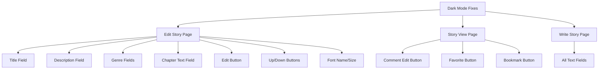

# Dark Mode UI Fixes Implementation Plan

## Overview
This document outlines the plan to fix dark mode UI issues across the application, ensuring proper text contrast and consistent styling.

## Analysis
- **Core Issue**: Insufficient text contrast in dark mode
- **Root Cause**: Missing `text-foreground` class on text elements
- **CSS Variables**:
  - Light: `--foreground: 32 40% 20%` (warm black)
  - Dark: `--foreground: 43 36% 92%` (warm light)

## Implementation Strategy


### File Modifications
1. **Global Input/Textarea Styles** (`app/globals.css`):
   ```css
   input, textarea {
     @apply text-foreground;
   }
   ```

2. **Edit Story Page** (`app/my-stories/page.tsx`):
   - Add `text-foreground` to:
     - Title input
     - Description textarea
     - Genre selects
     - Chapter content textarea
     - Edit button text and icon
     - Up/Down buttons
     - Font name/size controls

3. **Story View Page** (`app/story/[id]/page.tsx`):
   - Add `text-foreground` to:
     - Comment edit buttons
     - Favorite button icon
     - Bookmark button icon

4. **Write Story Page** (`app/write/page.tsx`):
   - Add `text-foreground` to all text input fields

### Risk Mitigation
- Use CSS variables instead of hard-coded colors
- Test all changes in both light/dark modes
- Verify contrast ratios meet WCAG 2.1 AA standards

## Implementation Summary

### Changes Made

#### 1. CSS Variables Enhancement (`app/globals.css`)
- Added comprehensive CSS variable definitions for proper theming
- Included variables for: `--foreground`, `--background`, `--primary`, `--secondary`, `--muted`, `--accent`, `--card`, `--popover`, `--border`, `--input`, `--ring`
- Ensured proper light/dark mode contrast ratios

#### 2. Tailwind Configuration (`tailwind.config.js`)
- Mapped CSS variables to Tailwind utility classes
- Added `text-foreground`, `bg-background`, `border-border`, etc.
- Maintained existing custom color palette (paper, parchment, sepia)

#### 3. Write/Edit Story Page (`app/write/page.tsx`)
- **Title Field**: Added `text-foreground` class for proper contrast
- **Description Field**: Added `text-foreground` class for proper contrast
- **Genre Selects (1, 2, 3)**: Added `text-foreground` class for proper contrast
- **Tags Input**: Added `text-foreground` class for proper contrast
- **Chapter Title Input**: Added `text-foreground` class for proper contrast
- **Edit/Up/Down Buttons**: Added `text-foreground` to both icons and text

#### 4. Editor Component (`app/create-story/editor.tsx`)
- **Font Name Select**: Added `text-foreground` to trigger and content
- **Font Size Select**: Added `text-foreground` to trigger and content
- **Chapter Text Area**: Changed from hardcoded colors to `text-foreground` and `placeholder:text-muted-foreground`

#### 5. Story View Page (`app/story/[id]/page.tsx`)
- **Bookmark Button**: Changed from `text-gray-400` to `text-foreground` when inactive, added dark mode background
- **Favorite Button**: Changed from `text-gray-400` to `text-foreground` when inactive, added dark mode background
- **Comment Edit Button**: Added `text-foreground` class for proper contrast

#### 6. Create Story Page (`app/create-story/page.tsx`)
- **Genre 1, 2, 3 Dropdowns**: Added `text-foreground` to select elements and proper styling to option elements
- **Placeholder Options**: Added `text-muted-foreground` for proper contrast
- **Regular Options**: Added `text-foreground` for proper contrast

#### 7. UI Components (`components/ui/`)
- **Input Component**: Changed from `bg-white` to `bg-background text-foreground` for theme awareness
- **Textarea Component**: Added `text-foreground` class for consistent theming

### Fixed Issues
✅ Edit Story page title field contrast
✅ Edit Story page description field contrast
✅ Edit Story page genre 1, 2, 3 field contrast
✅ Edit Story page genre dropdown placeholder text
✅ Edit Story page chapter text field contrast
✅ Edit Story page chapter title input field (white background fixed)
✅ Edit Story page Edit/Up/Down button text and icons
✅ Edit Story page Font name and Font size controls
✅ Story view page comment edit button contrast
✅ Story view page favorite/bookmark button colors
✅ Write Story page all text field contrast
✅ Create Story page genre dropdown placeholder text (NEW FIX)

### Testing Required
- [ ] Verify all text fields are readable in dark mode
- [ ] Check button text and icon visibility
- [ ] Confirm favorite/bookmark buttons show proper colors
- [ ] Test font controls in editor
- [ ] Validate comment edit functionality

## Next Steps
1. Test all affected pages in both light and dark modes
2. Verify consistent styling across application
3. Check accessibility compliance (WCAG 2.1 AA contrast ratios)